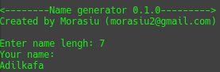
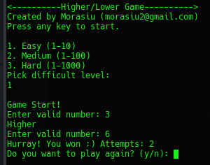
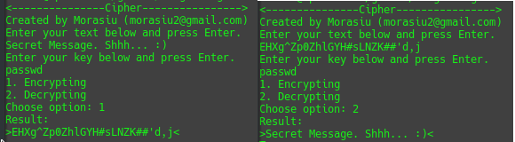
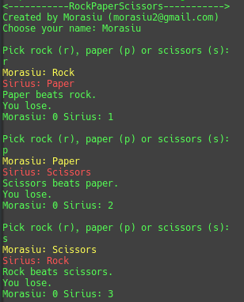
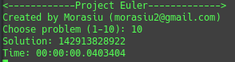

# ProgramingChallenges
All task from list of Programming Challenges v1.4

If you have any questions, you can contact me by email morasiu2@gmail.com

## Table of content
1. [00 Name generator](#00)
1. [01 Higher/lower](#01)
1. [02 Temperature Converter](#02)
1. [03 Age Calculator](#03)
1. [04 Cipher](#04)
1. [05 FizzBuzz](#05)
1. [06 RockPaperScizzors with AI](#06)
1. [07 Project Euler (first10 problems)](#07)

## Progress
All - **100**  
Done - **5**  
Remain - **95**  

* <a name="00">00</a> Name Generator - 29.01.2018 *Done* (`Python 3`)  

* <a name="01">01</a> Higher/lower - 31.01.2018 *Done* (`C#`)  

* <a name="02">02</a> Temperature Converter - 05.02.2018 *Done* (`C#`)  

* <a name="03">03</a> Age Calculator - 07.02.2018 *Done* (`C#`)  

* <a name="04">04</a> Cipher - 08.02.2018 *Done* (`C#`)  

* <a name="05">05</a> FizzBuzz - 08.02.2018 *Done* (`C#`)  

* <a name="06">06</a> RockPaperScizzors with AI (Check diagram in directrory) - 14.02.2018 *Done* (`C#`)  

* <a name="07">07</a> Project Euler (first 10 problems) - 24.02.2018 *Done* (`C#`)
[Project Euler](https://projecteuler.net/archives)  

