# Programming Challenges

All task from list of Programming Challenges v1.4
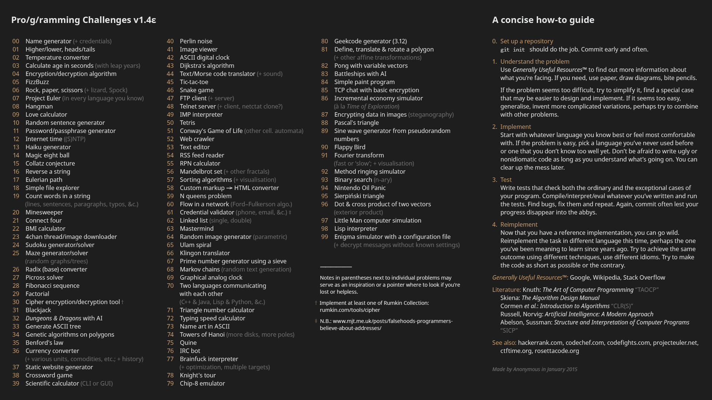

If you have any questions, you can contact me by email morasiu2@gmail.com

## Table of content

* [00 Name generator](#00)
* [01 Higher/lower](#01)
* [02 Temperature Converter](#02)
* [03 Age Calculator](#03)
* [04 Cipher](#04)
* [05 FizzBuzz](#05)
* [06 RockPaperScizzors with AI](#06)
* [07 Project Euler (first 10 problems)](#07)
* [08 Hangman (with online words)](#08)
* [09 Love Calculator](#09)
* [10 Random Sentence Generator](#10)
* [11 Password Generator](#11)
* [12 Internet Time](#12)
* [13 Haiku Generator](#13)
* [14 Magic 8-ball](#14)
* [15 Collatz Conjecture](#15)
* [16 Reverse String](#16)
* [~~17 Eurelian Path~~](#17)
* [18 Simple File Explorer](#18)

## Bonus

1. [Loading animation](#bonus1)

## Progress

All - **100** <br>
Done - **18** <br>
Remain - **82** <br>

* <a name="00">00</a> Name Generator - 29.01.2018 *Done* (`Python 3`) <br>

* <a name="01">01</a> Higher/lower - 31.01.2018 *Done* (`C#`) <br>

* <a name="02">02</a> Temperature Converter - 05.02.2018 *Done* (`C#`) <br>
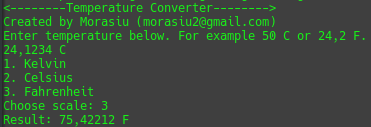
* <a name="03">03</a> Age Calculator - 07.02.2018 *Done* (`C#`) <br>
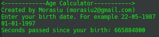
* <a name="04">04</a> Cipher - 08.02.2018 *Done* (`C#`) <br>
[Encrypting](docs/Cipher.md)<br>

* <a name="05">05</a> FizzBuzz - 08.02.2018 *Done* (`C#`) <br>
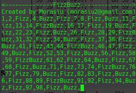
* <a name="06">06</a> RockPaperScizzors with AI (Check diagram in directrory) - 14.02.2018 *Done* (`C#`) <br>
[AI algorithm](docs/RPC_AI_Alorithm.png)<br>

* <a name="07">07</a> Project Euler (first 10 problems) - 24.02.2018 *Done* (`C#`)
[Project Euler](https://projecteuler.net/archives) <br>

* <a name="08">08</a> Hangman (with online words) - 24.02.2018 *Done* (`C#`)
Words are from [Fake Name Generator](https://fakena.me/random-english-words/one/), but these are real words. Trust me.
Definitions are form [FreeDictionary](https://www.thefreedictionary.com/) </br>
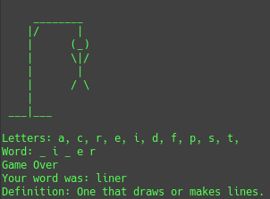
* <a name="09">09</a> Love Calculator - 27.02.2018 *Done* (`C#`)<br>
[How it works](docs/LoveCalculator.md)<br>

* <a name="10">10</a> Random Sentence Generator - 28.02.2018 *Done* (`C#`) <br>

* <a name="11">11</a> Password Generator - 28.02.2018 *Done* (`C#`) <br>
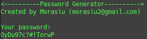
* <a name="12">12</a> ~~Internet Time~~ Clock - 01.03.2018 *Done* (`C#`)
Why Clock? I found Internet Time quite boring challenge so I've made clock with ASCII art. <br>
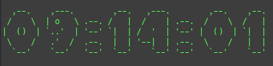
* <a name="13">13</a> Haiku Generator - 02.03.2018 *Done* (`C#`) <br>
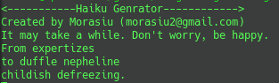
* <a name="14">14</a> Magic 8-ball - 06.03.2018 *Done* (`C#`) <br>
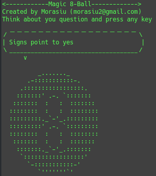
* <a name="15">15</a> Collatz Conjecture - 06.03.2018 *Done* (`C#`) <br>
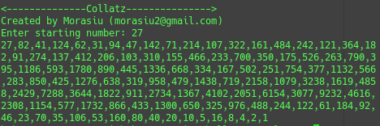
* <a name="16">16</a> Reverse String - 07.03.2018 *Done* (`C#`) <br>
Yeah, so... Reverse string isn't that hard so I've made one-liner challenge
```csharp
string.Concat(text.Reverse())
```
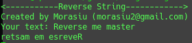
* <a name="17">17</a>~~Eurelian Path~~<br>
Why I didn't solve that challenge? It sounds fun, but I hate writing GUI and that would be a nightmare for me.
Maybe some day? 
* <a name="18">18</a> Simple file Explorer - 09.08.2018 *Done* (`C#`)<br>
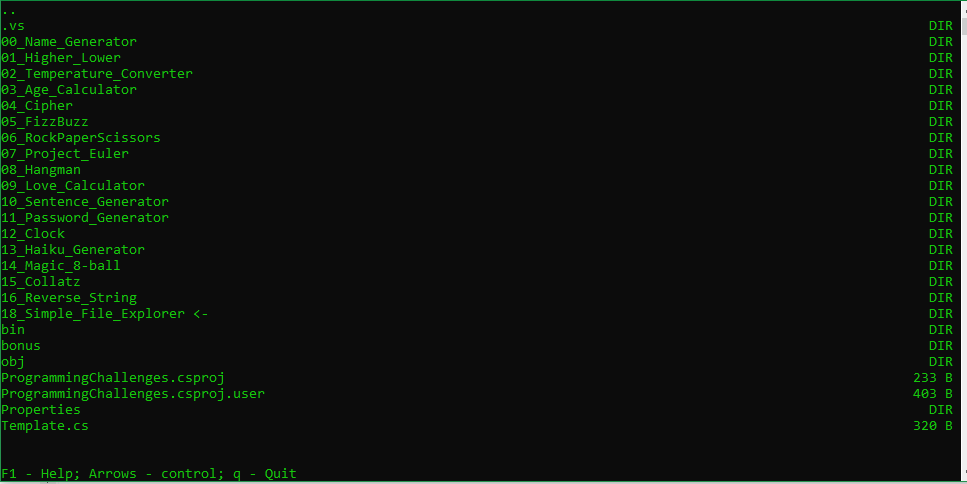
## Bonus
* <a name="bonus1">Bonus 1</a> Loading animation in console 24.02.2018 *Done* (`C#`)
